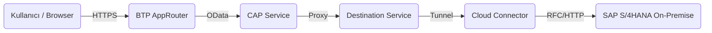

# 📊 SAP Vendor Line Items Dashboard (BTP & CAP)

**SAP On-Premise Açık Kalemler (FAP_VENDOR_LINE_ITEMS_SRV) Dashboard Uygulaması**

Bu proje, **SAP BTP (Business Technology Platform)** üzerinde çalışan ve **Cloud Connector** aracılığıyla yerel (On-Premise) SAP ERP sisteminden canlı veri çeken modern bir web uygulamasıdır.

🔗 **Canlı Demo (Örnek):** `https://<subaccount>-<space>-btp-api-approuter.cfapps.us10-001.hana.ondemand.com/webapp/index.html`

---

## 🚀 Projenin Amacı

Şirketlerin finans ve satınalma departmanları için; satıcıların (Vendor) açık faturalarını, vadesi geçen borçlarını ve ödeme durumlarını tek bir modern ekrandan izlemelerini sağlar.

*   **SAP GUI'ye girmeye gerek kalmadan** verilere erişim.
*   **VPN gerektirmez** (Cloud Connector teknolojisi sayesinde).
*   **Mobil uyumlu** ve hızlı arayüz.

---

## 🛠 Kullanılan Teknolojiler

Bu proje **SAP Cloud Application Programming Model (CAP)** ile geliştirilmiştir.

| Teknoloji | Açıklama |
| :--- | :--- |
| **Backend** | SAP CAP (Node.js), SAP Cloud SDK |
| **Frontend** | HTML5, CSS3, Vanilla JS (AppRouter ile sunulur) |
| **Connectivity** | SAP Cloud Connector, Connectivity Service |
| **Auth** | SAP XSUAA (OAuth 2.0) |
| **Destination** | BTP Destination Service (`EXTERNAL_ONPREM_API`) |
| **CI/CD** | GitHub, MTA Build Tool (MBT) |

---

## 🏗 Mimari Yapı

Uygulama, **Side-by-Side Extension** modeliyle çalışır. Yani SAP çekirdeğine dokunmadan, dışarıdan güvenli bir eklenti olarak geliştirilmiştir.



---

## 📦 Kurulum ve Çalıştırma

### 1. Gereksinimler
*   SAP BTP Hesabı (Trial veya Enterprise).
*   SAP Cloud Connector (Kurulu ve Subaccount'a bağlı).
*   Node.js ve `cds-dk` yüklü olmalı.

### 2. Yerel Geliştirme (Local Dev)
```bash
# Projeyi klonla
git clone https://github.com/imambakircayci/ODEME-BTP.git

# Bağımlılıkları yükle
npm install

# (Opsiyonel) Yerel test için cds watch
cds watch
```

### 3. BTP'ye Deploy (MTA)
```bash
# Build işlemini başlat
mbt build

# Oluşan arşiv dosyasını deploy et
cf deploy mta_archives/btp-api_1.0.0.mtar
```

---

## 🔑 Önemli Servis Konfigürasyonları

### Destination Ayarı (BTP Cockpit)
Projenin çalışması için BTP Cockpit içerisinde `EXTERNAL_ONPREM_API` adında bir destination tanımlanmalıdır:
*   **Name:** `EXTERNAL_ONPREM_API`
*   **Type:** `HTTP`
*   **URL:** `http://<virtual-host>:<port>`
*   **Proxy Type:** `OnPremise`
*   **Authentication:** `BasicAuthentication`
*   **Properties:** `sap-client=100`, `HTML5.DynamicDestination=true`

---

## 📝 Lisans
Bu proje özel kullanım içindir.
